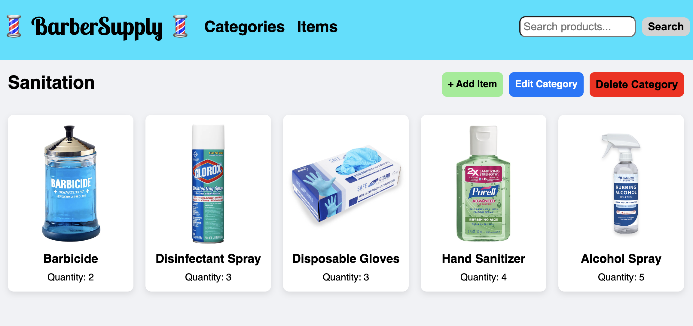

# 💈 BarberSupply 💈

This is a CRUD inventory management app built with **Node.js**, **Express**, and **PostgreSQL**, designed for a small barber shop. The app helps the shop owner (my mom) manage and track various supplies used in the shop.

  

## Features

- **Full CRUD Operations**: View, add, update, and delete categories and items in the shop's inventory.
- **Categories**: Organize items into categories like Hair Products, Shaving Supplies, and more.
- **Search Functionality**: Instantly search for any item by name.
- **Image Uploads**: Upload and edit item images for better visual tracking.
- **Mobile-Responsive Design**: Smooth experience on phones, tablets, and desktops.
